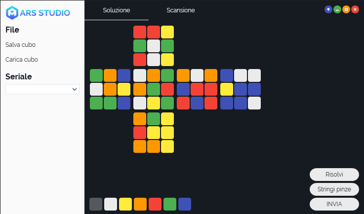
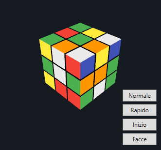

# ARS Studio

This is Ars Studio, an Open Souce Software to solve your Rubik Cube in less than 25 moves.
The Software is optimized and tested by our team of informatics and mechanics, it takes little to learn! And with the addition of ARS Color, it is possible to optimize the workflow for maximum efficiency.

# Optimization

ARS Studio has a perfect integration with the machine through serial communication for better results.

- The software’s completely open source and is gonna be multiplatform
- It’s easy and fast setting up the cube state
- Immediate support for .cst format

# 3 Steps to setup the cube

In this section we’ll show you how easy and intuitive it is to work with ARS Studio in 3 simple steps.
 - First of all you have to choose a color, you can use the keyboard and the numbers from 1 to 6
 - After choosing the color, insert it in it’s position inside the grid
 - Press the “Risolvi” button to have the software solve one of the fastest and most effective algorithms there are.

 

# How to start

You have to go in repository: **ARS Studio\ARS Studio\bin\Debug** and click on **Ars Studio.exe**
